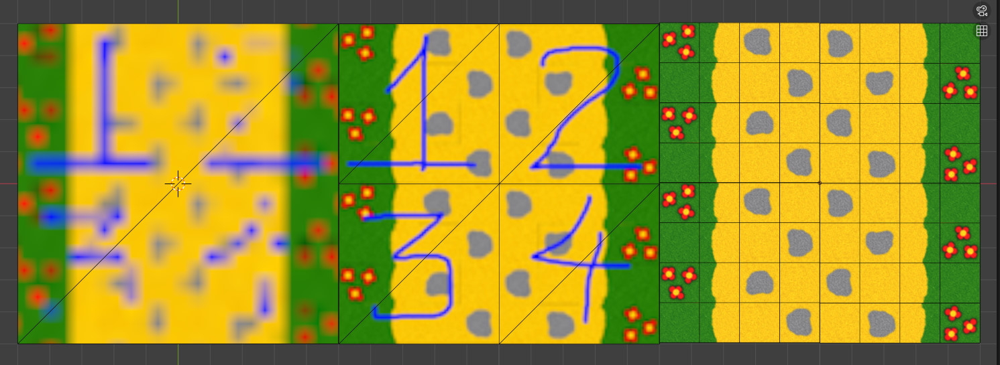

## Quad block LoD sample
This folder contains a blender project demo, it includes 3 separate square pieces to represent 3 logical LoD levels of the game.



## Lowest LoD
Just a single quad that connects outer corners of the quadblock. The entire quadblock texture is rendered for the smallest lod level to a single small texture, usually 24x24 (3 pixels per source tile).

## Middle LoD
Core piece of the level, consists of 4 quads, uses a separate texture per quad. Every texture provides 2 additional smaller mip levels to reduce flickering in the distance, this does not affect the mesh.

## Highest LoD ("mosaic", "montage")
Subdivides every quad of middle LoD into 4x4, 4x2 or 4x1 pieces. A kind of 8/16 bit style tile map. Every individual piece is usually up to 64x64, resulting in a 512x512 texture for the entire quadblock. Every tile can be flipped an rotated freely.

## Tiled map
```small_tiles``` folder in addition contains a Tiled map and tileset.

## Additional stuff
```combined_textures``` contains additional previews of the data. For example, a combined atlas of the smaller_tiles and Tiled preview screenshot. These are not actually used in the game.
